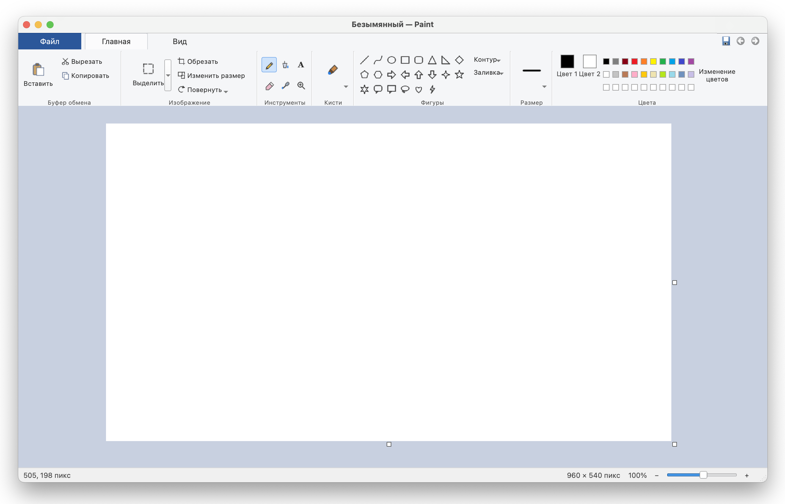

# 🎨 WinPaint

**Windows 10 Paint — reimagined for Linux & macOS**


A faithful recreation of the classic Microsoft Paint from Windows 10, built entirely with Python and PyQt5. Runs natively on Linux and macOS with a fully Russian-language interface.



---

## ✨ Features

| Category | Details |
|----------|--------|
| **Brushes** | 8 types: round, calligraphy ×2, airbrush, oil, crayon, marker, watercolor |
| **Drawing Tools** | Pencil, eraser, flood fill, color picker, text, magnifier |
| **Shapes** | Line, curve, rectangle, rounded rectangle, oval, triangles, diamond, pentagon, hexagon, arrows, stars, callouts, heart, lightning |
| **Shapes Options** | Outline & fill styles, adjustable line thickness |
| **Colors** | Dual colors (left/right mouse button), full palette, custom color picker |
| **Selection** | Rectangle select, move, cut/copy/paste, crop to selection |
| **Transform** | Resize (% and pixels), rotate 90°/180°, flip horizontal/vertical |
| **Canvas** | Drag handles to resize canvas without scaling the image |
| **History** | Undo/Redo (up to 40 steps) with Ctrl+Z / Ctrl+Y |
| **Zoom** | Slider + buttons, Ctrl+scroll, pixel grid at 200%+ |
| **File Formats** | Open/Save: PNG, JPEG, BMP, TIFF, WebP, ICO; Open: GIF |
| **Printing** | Print with system dialog |

---

## 📥 Installation

### macOS

1. Download **WinPaint-macOS-Intel.zip** from [Releases](../../releases) (runs on Intel Macs natively and on Apple Silicon via Rosetta 2).
2. Extract the archive.
3. Drag **WinPaint.app** into your **Applications** folder.
4. On first launch, right-click the app → **Open** (to bypass Gatekeeper).

### Windows

1. Download **WinPaint-Windows-x64.exe** from [Releases](../../releases).
2. Run it — no installation required. If SmartScreen warns you, click **More info** → **Run anyway**.

### Linux

1. Download **WinPaint-Linux-x86_64.tar.gz** from [Releases](../../releases).
2. Extract:
   ```bash
   tar xzf WinPaint-Linux-x86_64.tar.gz
   cd WinPaint-Linux-x86_64
   ```
3. Install:
   ```bash
   sudo bash install.sh
   ```
4. Find **Paint** in your applications menu, or run:
   ```bash
   winpaint
   ```

---

## 🔧 Build from Source

### Prerequisites

```bash
pip3 install PyQt5 pyinstaller
```

### Run without building

```bash
python3 src/run.py
```

### Build for macOS

```bash
bash scripts/build_macos.sh
```

Output: `dist/WinPaint-macOS.zip`

### Build for Linux

```bash
bash scripts/build_linux.sh
```

Output: `dist/WinPaint-Linux-x86_64.tar.gz`

---

## 🖌️ Drawing Tips

- **Straight lines / Squares / Circles:** Hold **Shift** while drawing — lines snap to 45° increments, rectangles become squares, ovals become circles.
- **Color 2 (right-click):** Draw with the right mouse button to use the secondary color.
- **Line thickness:** Use the **Size** button on the ribbon to change brush/pencil/eraser width.
- **Text tool:** Select the **A** tool, click on the canvas — a formatting toolbar appears at the top (font, size, **B**old, *I*talic, <u>U</u>nderline). Click outside the text box to stamp it.
- **Zoom:** Use the slider in the bottom-right corner, or `Ctrl` + scroll wheel. Scrollbars appear for navigating zoomed images.
- **Pixel grid:** Enable via View → Grid Lines (visible at 200%+ zoom).
- **Resize canvas:** Drag the small white square handles on the right/bottom edges of the canvas to extend or shrink the canvas area without scaling the image.
- **Eraser size:** The square under the cursor shows the eraser area. Change size via the Size button.

---

## 🗑️ Uninstall (Linux)

```bash
sudo bash /opt/winpaint/uninstall.sh
```

Or from the extracted archive:

```bash
sudo bash uninstall.sh
```

---

## 📝 Notes

- **GIF files** can be opened but not saved (Qt limitation). The app will offer to save as PNG instead.
- The interface language is **Russian**, matching the original Windows 10 Paint experience.
- On Linux, if images still open in another app after installation, right-click a file → "Open With" → choose **Paint** and set as default.

---

## 📄 License

MIT License — see [LICENSE](LICENSE) for details.
